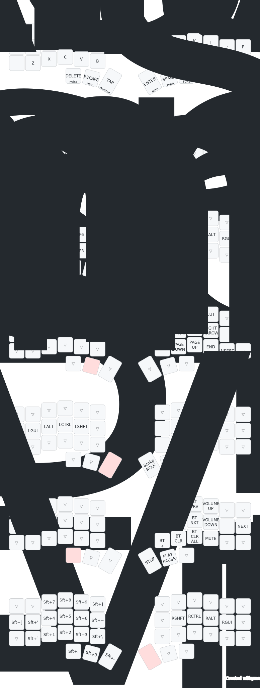

# ZMK Corne 42-key Config

This is the ZMK configuration for my handwired Corne 42-key keyboard.

## Keymap

Generated using the [keymap-drawer web application](https://keymap-drawer.streamlit.app/).
